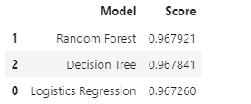

 
# Final Project Group 3

   

### Overview
Covid-19 caused a global pandemic so this data is  relevant to what is happening across the globe. 

The Google Slides presentation for this project can be found 
here on [Google Slides](https://docs.google.com/presentation/d/1R6NoK6VatRhL9BzGuit1nTV8Zf-JTV8qRfew4igPopU/edit#slide=id.gc12a178845_0_155).

### Reason why we selected the topic 
It's more relavent to what is happening currently across the globe

### Description of the source of data
Two datasets are
- https://data.cdc.gov/Case-Surveillance/COVID-19-Case-Surveillance-Public-Use-Data/vbim-akqf
- https://www.visualcapitalist.com/visualizing-u-s-population-by-race/#:~:text=As%20of%202019%2C%20here%20is,Black%3A%2012.2%25

### Questions we hope to answer with the data

1.   Correlation between ethnic groups and covid related deaths. 
2. Distribution of hospitalization by age group.
3.  Use ML model to predict the probability of a person dying from covid based on sex, age, ethnicity, underlying medical conidtion, hospitlization and  intensive care unit.

### Description of the communication protocols
- zoom
- slack

### Potential Steps
- STEP 1 - Create DF 
- STEP 2 - Clean Datasets 
- STEP 3 - Visualize Data
- STEP 4 - CREATE ERD
- STEP 5 - Merge Datasets using SQL ( INNER JOIN) using Country
- STEP 6 - Export to CSV
- STEP 7 - Feed into ML for question 3
- STEP 8 - Dashboard
- STEP 9 - Work On Presentation

### Technologies Used 

- Use Jupyter Notebook, Pandas and Python to load in the data of covid case surveillance data from the CDC government website
- Perform ETL by dropping the nan and missing values, deleting columns we dont need, and 
- Create data frames and clean up the data 
- Use data frames to plot graphs and pie charts and show the appropriate visualisations we want to demonstrate 
- Create a database using AWS
- Run our data through Postgress and connect the server to RDS on AWSusing the endpoint URL
- Take the new dataset created through Postgress and export it into a csv file, and feed it into a machine learning model
- Use Tabelau to create our dashboard and make a powerpoint presentation

### Description of preliminary data processing

The process of preliminary data processing includes performing ETL on jupyter notebook to clean up our data and first loaded it into a csv file. We retrieved our data from the CDC government of covid surveillance data. We chose this dataset because it gives us a lot of information about  From there, we took our data and loaded it into pg admin, and set up a RDS on AWS and ran our database through it. 

### Description of preliminary feature engineering and preliminary feature selection, including decision making process
- Since we are predicting a binary outcome patient died or not, we dropped the date columns as they had no value to the machine learning model.
- Dropped Missing values in every column as they had no value.
- Used LabelEncoder to enocode the categorical values into numerical features to use for the Machine Learning models.

### How data was split into training and testing sets

- We will be using the 80/20 rule.

### Explanation of model choice, including limitation and benefits 

#### Logistic Regression
 - Using logistics regression since we are trying to predict a binary outcome, 0 (patient lived) or 1 (patient died).
 - Using features such as sex,	age_group,	race_ethnicity, hosp_yn, icu_yn, medcon
 - A benefit is this model is easy to implement.
 - A limitation is multiple features are needed for a model. 
#### Random Forest Classifier
 - Reliable ensemble maching learning model that uses mutiple Decisio Trees.
 - Random Forest Classifier to see if we can get a different accuracy score.
 - Once pro is using the feature importance to see the importance of the features selected.
 - Another benefit is it is suitable for large datasets.
 - A random forest is prone to overfitting. 
 - Our model can be biased towad variables with more levels.
 
##### Feature Importance 

- One of the benefits from using a random forest is using the above function to easily visualize our 
- Above shows the best features fo the Random Forest. 
- If we wanted to make our machine learning model better we could drop the less important feature.

#### Decision Tree Model
 - Decision Tree model was used from segment 3 to segment 3 to see the difference between a Random Forest and Decision Tree.
 - Simple machine learning module, clear representation.
 - Like Random Forest model is prone to Overfitting.
 - Since it only uses one root node and then splits after that, it wont be as beneficial as a Random Forest.

### Description of accuracy score 

- As seen from the image above our best model was Random Forest.
